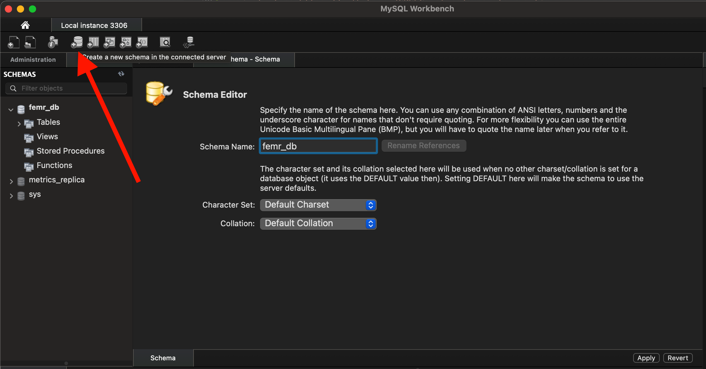
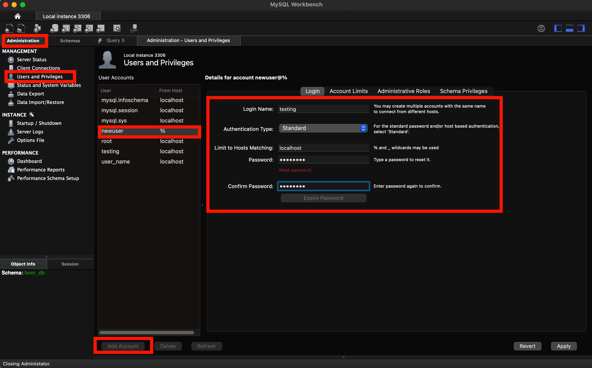
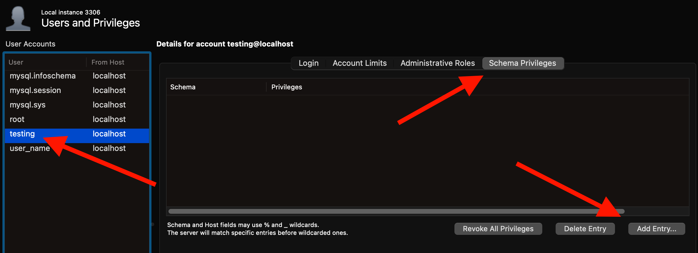
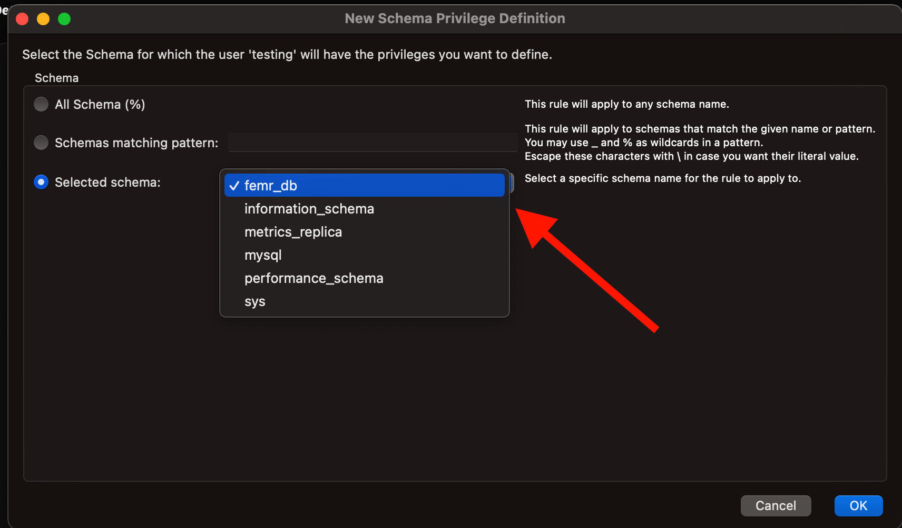
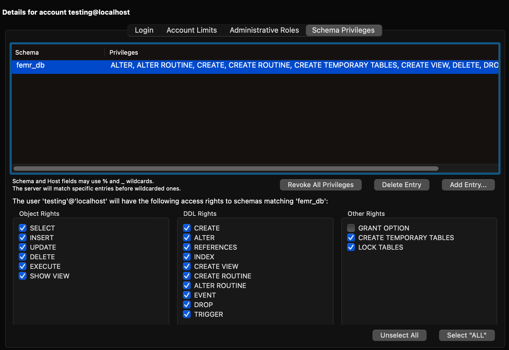

# fEMR - Fast Electronic Medical Records

## Description
fEMR is a fast EMR solution for remote clinics who depend on speed and ease of use rather than complex features. Check out [Team fEMR's website](https://teamfemr.org/) for more information and a live demo.

### Join our development community
1. Slack (will be updated soon!)
2. [JIRA](https://teamfemr.atlassian.net/jira/projects)
3. [Team fEMR](https://teamfemr.org/)

## Running the application using Docker
1. Make sure you have [Docker](https://docs.docker.com/get-docker/) installed and running on your machine.
2. Clone the [FEMR/femr](https://github.com/FEMR/femr) repo and checkout the [super-femr](https://github.com/FEMR/femr/tree/super-femr) branch.
3. Cd into the super-femr directory: `cd super-femr`
4. Run `docker-compose up` to start the app.
5. If step 4 successfully finishes, the app will be available at http://localhost:9000/

## Setting up the project with IntelliJ

### Step 1: Download and Install the following Software and Dependencies 
- [IntelliJ IDEA Ultimate](https://www.jetbrains.com/idea/download/)
- [MySQL Server](https://dev.mysql.com/downloads/mysql/)
- [MySQL Workbench](https://dev.mysql.com/downloads/workbench/)
- [Java JDK 1.8](http://www.oracle.com/technetwork/java/javase/downloads/jdk8-downloads-2133151.html)
- [Git](http://git-scm.com/)

### Step 2: Clone the repo 
- `git clone https://github.com/CPSECapstone/super-femr.git`

### Step 3: Setting up the DB 
1. Open the MySQL Workbench.
2. Select the db icon to create a new schema and call it `femr_db`.

<details> <summary> screenshot </summary>



</details>

3. Under the Administration tab, select `User and Priviliges`. Then `Add account` and add `Login name` and `Password` of your preference. Save the login and password because you will need it in the later steps. 
     - For this example, I used `testing` for the username and `password` for the  password. 

<details> <summary> screenshot </summary>



</details>

4. Then go to the `Schema Privileges` tab, select `Add Entry...` for the user you created in the previous step, and select the `femr_db` schema.

<details> <summary> screenshot </summary>





</details>

5. Give all of the rights, except the `GRANT OPTION`. 

<details> <summary> screenshot </summary>



</details>

### Step 4: IntelliJ IDEA Ultimate

1. Open IntelliJ IDEA Ultimate. Then open the `super-femr` repo from step 2.

2. In IntelliJ IDEA Ultimate and go to `Preferences` -> `Plugins` -> click `Marketplace` -> Then download `Scala` and `Play Framework`. Then restart the IDE.

3. Inside `super-femr/conf` folder, create a new file named  `application.dev.conf`. 
4. Copy the following settings inside and save it. Note that `db.default.username` and `db.default.password` values must match the account and password from the Step 3.3. For this example, my username is `testing` and password is `password`.

```
include "application.conf"
settings.researchOnly=0
db.default.url="jdbc:mysql://127.0.0.1:3306/femr_db?characterEncoding=UTF-8"
db.default.username="testing"
db.default.password="password"
photos.defaultProfilePhoto="./public/img/defaultProfile.png"
csv.path="./Upload/CSV"
```

5. Go to `Run` -> `Edit Configurations` -> click on the `+` sign -> `Play 2 App`.
6. Then, click on `Edit Environment Variables` -> add the following two environment variables: `user.dir` and `config.file` (make sure to change the value based on where the two are stored on your local machine). Then click apply and ok.
    - `config.file` is the path for application.dev.conf.
    - `user.dir` is the path for the project.


7. Go to `File` -> `Project structure` -> Under the `Project` tab -> Select `Project SDK` and set it to 1.8. 
    - You can download 1.8 directly from IntelliJ. If so, choose 1.8 Amazon Correto.

8. Change the language level to 8.

9. On the rightmost side of IntelliJ, if there is a vertical line containing sbt. Click on the sbt tab and then click the refresh symbol.
      - If there isn’t sbt on the right, remove the .idea folder from the root directory of the project. In the command line, traverse to the root directory and do: rm -r .idea. Then redo step 2 and then continue. If still does not work try removing the project and recloning it again. 

10. After that runs, click on the Play button to run the configuration. If everything was set up correctly, the website should open up on another window. Select “Apply this script now”.

### Troubleshooting
1. Try deleting the .idea folder and rerunning sbt 
2. Confirm you have the absolute path in your environment variables
3. Try to re-apply the plugins Scala and Play Framework
4. Otherwise, try cloning the femr github and going through the steps once more.
5. Try invalidating Intellij IDEA cache.
