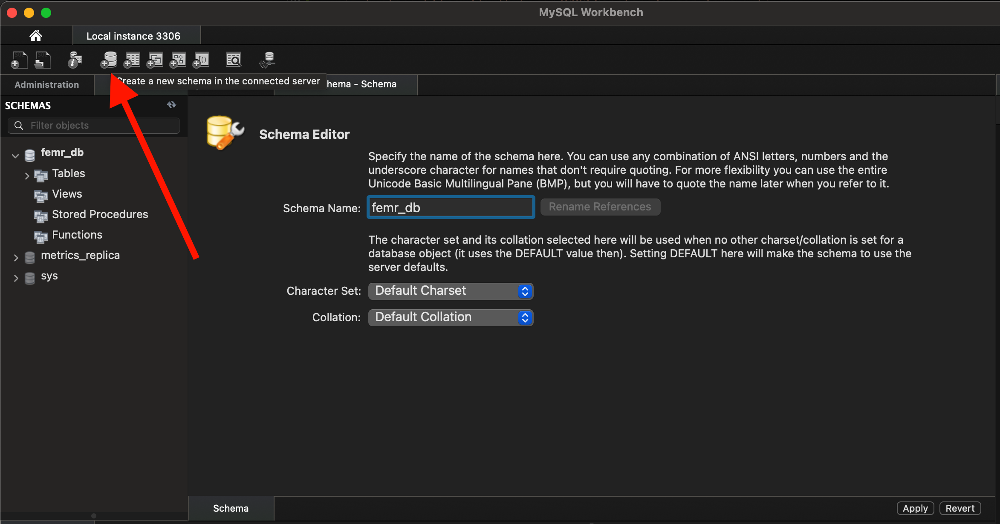

# fEMR - Fast Electronic Medical Records

## Description
fEMR is a fast EMR solution for remote clinics who depend on speed and ease of use rather than complex features. Check out [Team fEMR's website](https://teamfemr.org/) for more information and a live demo.

### Join our development community
1. Slack (will be updated soon!)
2. [JIRA](https://teamfemr.atlassian.net/jira/projects)
3. [Team fEMR](https://teamfemr.org/)

## Running the application using Docker
1. Make sure you have [Docker](https://docs.docker.com/get-docker/) installed and running on your machine.
2. Clone the [FEMR/femr](https://github.com/FEMR/femr) repo and checkout the [super-femr](https://github.com/FEMR/femr/tree/super-femr) branch.
3. Cd into the super-femr directory: `cd super-femr`
4. Run `docker-compose up` to start the app.
5. If step 4 successfully finishes, the app will be available at http://localhost:9000/

## Setting up the project with IntelliJ

### Step 1: Download and Install the following Software and Dependencies 
- [IntelliJ IDEA Ultimate](https://www.jetbrains.com/idea/download/)
- [MySQL Server](https://dev.mysql.com/downloads/mysql/)
- [MySQL Workbench](https://dev.mysql.com/downloads/workbench/)
- [Java JDK 1.8](http://www.oracle.com/technetwork/java/javase/downloads/jdk8-downloads-2133151.html)
- [Git](http://git-scm.com/)

### Step 2: Clone the repo 
- `git clone https://github.com/CPSECapstone/super-femr.git`

### Step 3: Setting up the DB 
1. Open the MySQL Workbench.
2. Select the db icon to create a new schema and call it `femr_db`.

<details> <summary> screenshot </summary>



</details>


(hi Bat! I am roughly listing the order of operations I took so you can put the links + make it pretty :))
Play Framework
Scala
Restart InteliJ IDEA

Clone the repo, make a project
configure the perferences with play and scala
1.8 jdk language level to 8

Edit the conf

...
### Edit application.dev.conf 
```
include "application.conf"
settings.researchOnly=0
db.default.url="jdbc:mysql://127.0.0.1:3306/femr_db?characterEncoding=UTF-8"
db.default.username="testing"
db.default.password="password"
photos.defaultProfilePhoto="./public/img/defaultProfile.png"
csv.path="./Upload/CSV"
```

Setup the MySQL Server
Setup the MySQL Workbench
.....
### Markdown

Markdown is a lightweight and easy-to-use syntax for styling your writing. It includes conventions for

```markdown
Syntax highlighted code block

# Header 1
## Header 2
### Header 3

- Bulleted
- List

1. Numbered
2. List

**Bold** and _Italic_ and `Code` text

[Link](url) and 
```

For more details see [GitHub Flavored Markdown](https://guides.github.com/features/mastering-markdown/).
